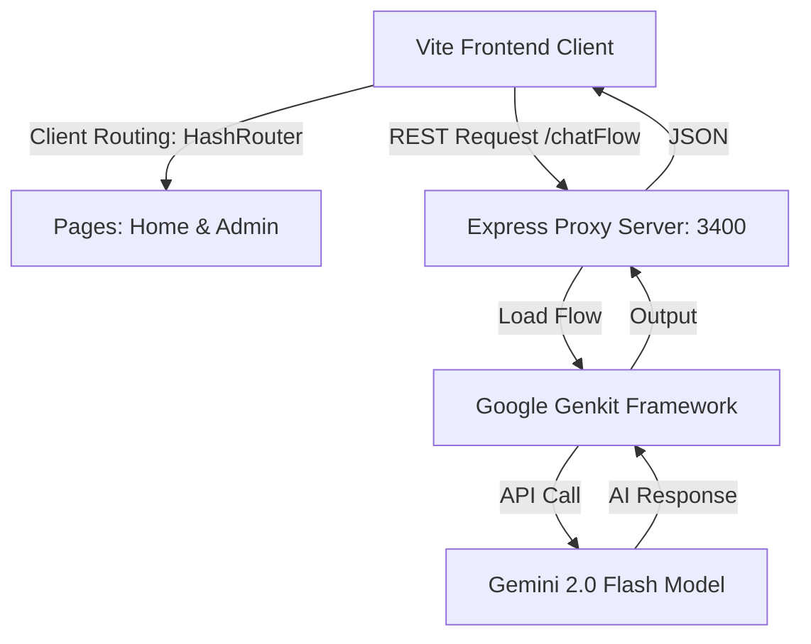

# 🚀 Zogna AI — Next-Generation Intelligent Chat & Admin Analytics Portal

[](https://github.com/TsegayDev/Zogna-AI/actions/workflows/deploy.yml)
[](https://github.com/firebase/genkit)
[](https://vite.dev)
[](https://react.dev)
[](https://www.typescriptlang.org)

**Zogna AI** is a premium, high-fidelity AI chat assistant and comprehensive administrative control portal. Built using React, Vite, TypeScript, and powered by Google Genkit with Gemini models, Zogna AI represents the pinnacle of modern web aesthetics, performance, and artificial intelligence integration.

---

## ✨ Features

### 💬 1. High-Fidelity Chat Experience
*   **Intuitive & Reactive Interface**: Stunning chat interface built using vanilla CSS variables, glassmorphism sidebars, and fluid micro-animations powered by **Framer Motion**.
*   **Structured Prompts**: Welcome dashboard presenting smart suggestions (Code Help, Creative Ideas, Writing, and Explanations) to jumpstart conversations.
*   **Smart Multi-Model Selection**: Instantly swap between state-of-the-art models like `Gemini 2.0 Flash` directly inside the message panel.
*   **Advanced File Parsing & Analysis**: Attach files (PDF, TXT, CSV, JSON, Markdown, Python, TS/JS, etc.) up to 10MB. The client-side visual loader tracks upload and parsing stages in real-time.
*   **Interactive Control Set**: Includes message copy-to-clipboard, quick re-runs (retry failed responses), streaming cancelation, and persistent multi-chat memory saved in LocalStorage.

### 🛡️ 2. Premium Admin Control Center (`/#/admin`)
*   **Real-time Analytics**: High-quality charts generated using **Recharts** displaying user registration flows, chat volumes, and platform active sessions.
*   **System Health Dashboard**: Modern visual metrics for system CPU load, memory utilization, and response latency.
*   **User Management System**: Full-scale tabular interface to monitor users, view operational logs, edit permissions, and toggle statuses (active, suspended).
*   **Dynamic Settings Panel**: Manage API rate limiting parameters, system models, temperature ceilings, and operational constants in a gorgeous grouped interface.

### 🤖 3. Google Genkit Core Integration
*   `chatFlow`: AI-guided conversation flow supporting rich markdown outputs or structured JSON array configurations for list enumerations.
*   `enhanceFailedResponse`: Automated secondary correction and fallback text optimization for network errors.
*   `generateSuggestedPrompts`: Intelligent suggestion generation matching current conversation contexts.
*   `summarizeChat`: Automatic chat log condensing for lighter memory profiles.

---

## 🛠️ Technology Stack

| Layer | Technologies |
| :--- | :--- |
| **Frontend** | React 18, Vite 8, TypeScript 5, React Router 6 (HashRouter) |
| **Styling** | CSS Variables, Tailwind CSS 3 (configured with theme tokens), Tailwind Animate |
| **Interactivity** | Framer Motion, Radix UI (Primitives), Lucide Icons |
| **Data Visualization**| Recharts (Responsive charts) |
| **AI Framework** | Google Genkit, `@genkit-ai/googleai` (Gemini 2.0 Flash) |
| **Backend** | Node.js, Express, Cors, Dotenv |
| **Automation** | GitHub Actions |

---

## ⚙️ Project Architecture Flow



---

## 🚀 Quick Start Guide

### 1. Prerequisites
Ensure you have **Node.js (v20+)** installed on your system.

### 2. Environment Setup
Create a `.env` file in the root directory and add your Google Gemini API Key:
```env
GEMINI_API_KEY=your_gemini_api_key_here
```

### 3. Install Dependencies
Run the following command to install all frontend and backend development dependencies:
```bash
npm install
```

### 4. Running the Development Servers
Zogna AI uses a split-process stack for development:
*   **Vite Dev Server (Frontend)**: Runs on port `9002`
*   **Genkit Wrapper Server (Backend)**: Runs on port `3400`

Run both simultaneously with ease:

```bash
# Terminal 1: Run the Genkit dev API wrapper
npm run genkit:dev

# Terminal 2: Run the Vite frontend client
npm run dev
```

The browser will automatically open to `http://localhost:9002`.

---

## 🌐 Production & GitHub Pages Deployment

Zogna AI is fully preconfigured for modern static-site hosting on **GitHub Pages**.

### 1. Clutter-Free Routing Setup
We use **`HashRouter`** in our production bundle to completely bypass 404 routing errors on static pages. This guarantees that direct links (e.g. `https://tsegaydev.github.io/Zogna-AI/#/admin`) work perfectly.

### 2. Dynamic API Backend Setup
When hosted on GitHub Pages, the frontend makes requests to a configured remote API server. Set your deployed backend URL using the environment variable:
```env
VITE_API_URL=https://your-deployed-zogna-backend.com
```
In local development, the app will seamlessly fall back to `/api` and use Vite's built-in proxy.

### 3. Automated CI/CD Deployments
We have included a highly-optimized **GitHub Actions workflow** (`.github/workflows/deploy.yml`). 
To deploy:
1. Push your code to your repository: `https://github.com/TsegayDev/Zogna-AI`.
2. The GitHub Action will automatically:
    * Checkout your codebase.
    * Install production dependencies using clean cache tools.
    * Compile TypeScript and build production assets using the `/Zogna-AI/` production asset base.
    * Deploy the built bundle directly to **GitHub Pages**!

---

## 📬 Contact & Support

This project is built and maintained with passion by **Tsegay Gebrekidan**.

*   **GitHub**: [TsegayDev](https://github.com/TsegayDev)
*   **Email**: [tsegaydev@gmail.com](mailto:tsegaydev@gmail.com)
*   **Phone**: [+251946351205](tel:+251946351205)

---
*Zogna AI — Crafted for Visual Excellence, Driven by Intelligence.*
